# MindBoost – учись, играя!

MindBoost – это инновационный образовательный сервис, превращающий обучение в увлекательное приключение! С помощью ИИ и геймификации ты можешь изучать любые темы поэтапно, развивать навыки, зарабатывать очки и соревноваться с друзьями.

## Как это работает?

1. Выбираешь или вводишь тему, которую хочешь изучать.

2. ИИ предлагает готовые учебные планы или создает персонализированный, адаптируя сложность под твой уровень (ИИ дает возможность выбора сложности).

3. Проходишь интерактивные уровни с заданиями и тестами.

4. Получаешь награды, следишь за прогрессом и поднимаешься в рейтинге.

## Функциональные требования

### Регистрация, вход, восстановление пароля

- Пользователь должен иметь возможность зарегистрироваться, указав адрес электронной почты, уникальный никнейм (он же логин, аналогично GitHub), а также пароль.

- При регистрации система должна проверять корректность введенных данных и отправлять подтверждающее письмо на указанную почту.

- Вход возможен с использованием почты/телефона/никнейма и пароля.

- Поддержка входа через OAuth (Google, Apple, Госуслуги).

- Возможность восстановления пароля через почту.

### Управление профилем

- Просмотр и редактирование профиля (аватар, никнейм, краткая информация, рамка профиля, фон, витрина достижений).

- Отображение статистики (количество пройденных уровней, рейтинг, достижения).

### Создание и прохождение образовательных маршрутов

- Пользователь выбирает или вводит тему обучения.

- Система с помощью ИИ строит **учебный план** с разделением на **уровни** или предлагает готовые маршруты.

- Пользователь может оставить отзыв на учебный план, который смогут увидеть другие пользователи

- **Учебный план** состоит из **уровней**, каждый из которых включает **теоретический материал**, **задания** и **контрольный тест**.

- **Теоретический материал** – основы для успешного прохождения заданий и тестов.

- **Контрольный тест** – это набор заданий, объединенных в одно итоговое задание для закрепления материала.

- **Задания** – упражнение для практического применения знаний. Задания бывают:

    1. **Классические**  

        - Выбор одного или нескольких правильных ответов

        - Заполнение пропусков

        - Соответствие

        - Правда или ложь

    2. **Интерактивные**  
        - Перетаскивание элементов (Drag & Drop)

        - Реконструкция текста/кода

        - Аудио/видео-вопросы

    3. **Практические**  

        - Написание ответа

        - Решение задач

        - Работа с симуляторами

    4. **Геймифицированные**  

        - Мини-игры

        - Квесты и сценарии

        - Испытания на время

- Без прохождения итогового теста и заданий на оценку В (и выше) продвигаться на следующий уровень нельзя.

- Возможность пересдачи заданий/тестов для улучшения результата.

- Возможность добавления курса в избранное.

### Геймификация

- У пользователей есть **личный уровень**, который растет при прохождении образовательных программ.

- Очки опыта (XP) начисляются за:

    - Прохождение уровней (+100 XP)

    - Высокие оценки на тестах (A – +50 XP, B – +30 XP, C – +10 XP)

    - Достижения (например, "10 дней подряд занятий" – +200 XP)

    - Создание и публикация учебных маршрутов (+300 XP при 10 лайках)

- Награды - внутрення валюта, начисляются подобно XP. Их можно использовать для кастомизации профиля (рамки для аватарки, фоны, витрина достижений).

- В системе есть **рейтинг пользователей**, основанный на XP, полученных за месяц. Каждый месяц рейтинг сбрасывается.

- Достижения за активность (например, "10 дней подряд занятий").

### Коммьюнити и взаимодействие

- Возможность делиться учебными планами (создание ссылок на них).

- Возможность подписаться на другого пользователя.

### Поиск

- Поиск образовательных курсов по ключевым словам.

- Сортировка курсов по популярности (количество пользователей, добавивших курс в избранное).

### Статистика и аналитика

- Детальная статистика обучения (пройденные темы, прогресс, оценки, ошибки).

- Визуализация прогресса в виде графиков.

## Основные сущности

### **1. Пользователи (users)**

|Атрибут|Тип данных|Описание|
|---|---|---|
|`user_id`|`UUID, PK`|Уникальный идентификатор|
|`nickname`|`VARCHAR(50), UNIQUE`|Уникальный никнейм|
|`email`|`VARCHAR(100), UNIQUE`|Почта|
|`password_hash`|`TEXT`|Захешированный пароль|
|`created_at`|`TIMESTAMP`|Дата регистрации|
    

### **2. Профиль пользователя (user_profiles)**

Основная таблица профиля с улучшенной структурой.

| Атрибут         | Тип данных     | Описание         |
| --------------- | -------------- | ---------------- |
| `user_id`       | `UUID, PK, FK → users.user_id`  | Первичный ключ |
| `avatar_url`    | `TEXT`                            | URL аватара (без ограничения длины) |
| `bio`           | `TEXT`                            | Описание пользователя               |
| `profile_frame_id`      | `UUID, FK → profile_frames.profile_frame_id`      | Связь с рамкой профиля              |
| `profile_background_id` | `UUID, FK → profile_backgrounds.profile_background_id` | Связь с фоном профиля               |
| `created_at`    | `TIMESTAMP`                       | Дата создания профиля               |
| `updated_at`    | `TIMESTAMP`                       | Дата последнего обновления          |

**Связи:**

- `1:1` → `users (user_id)`
    
- `M:1` → `profile_frames (profile_frame_id)`
    
- `M:1` → `profile_backgrounds (profile_background_id)`

### **3. Витрина достижений (user_showcase_achievements)**

Отдельная таблица для хранения достижений в витрине профиля.

|Атрибут|Тип данных|Описание|
|---|---|---|
|`user_profile_id`|`UUID, FK → user_profiles.user_profile_id`|Связь с профилем|
|`achievement_id`|`UUID, FK → achievements.achievement_id`|Связь с достижением|
|`display_order`|`INT`|Порядок отображения (1, 2, 3...)|
|`added_at`|`TIMESTAMP`|Дата добавления в витрину|
|**PK**|`(user_id, achievement_id)`|Первичный ключ|
    
**Связи:**

- `M:1` → `user_profiles (user_profile_id)`
    
- `M:1` → `achievements (achievement_id)`
    

### **4. Рамки профиля (profile_frames)**

Справочник доступных рамок для профиля.

|Атрибут|Тип данных|Описание|
|---|---|---|
|`profile_frame_id`|`UUID, PK`|Уникальный идентификатор|
|`name`|`VARCHAR(100)`|Название рамки|
|`image_url`|`TEXT`|URL изображения рамки|
|`unlock_condition`|`TEXT`|Условие разблокировки|

### **5. Фоны профиля (profile_backgrounds)**

Справочник доступных фонов для профиля.

|Атрибут|Тип данных|Описание|
|---|---|---|
|`profile_background_id`|`UUID, PK`|Уникальный идентификатор|
|`name`|`VARCHAR(100)`|Название фона|
|`image_url`|`TEXT`|URL изображения фона|
|`unlock_condition`|`TEXT`|Условие разблокировки|
|`is_premium`|`BOOLEAN`|Доступен только для премиум-пользователей|

### **6. Учебный план / Образовательный маршрут (syllabuses)**

Курс, составленный ИИ.

|Атрибут|Тип данных|Описание|
|---|---|---|
|`syllabus_id`|`UUID, PK`|Уникальный идентификатор|
|`title`|`TEXT`|Название курса|
|`description`|`TEXT`|Описание|
|`author_user_id`|`UUID, FK → users.user_id`|Автор промта|
|`created_at`|`TIMESTAMP`|Дата создания|

**Связи:**

- `M:1` → `users (user_id)`
    

### **7. Уровень (levels)**

Этап учебного плана, содержащий теорию, задания и итоговый тест.

|Атрибут|Тип данных|Описание|
|---|---|---|
|`level_id`|`UUID, PK`|Уникальный идентификатор|
|`syllabus_id`|`UUID, FK → syllabuses.syllabus_id`|Связь с курсом|
|`title`|`VARCHAR(100)`|Название уровня|
|`description`|`TEXT`|Описание|
|`order`|`INT`|Порядок в маршруте|

**Связи:**

- `M:1` → `syllabuses (syllabus_id)`

### **8. Теоретический материал (theoryes)**

Учебные материалы для уровней.

|Атрибут|Тип данных|Описание|
|---|---|---|
|`theory_id`|`UUID, PK`|Уникальный идентификатор|
|`level_id`|`UUID, FK → levels.level_id`|Связь с уровнем|
|`content`|`TEXT`|Учебный материал|

**Связи:**

- `M:1` → `levels (level_id)`

### **9. Задание (tasks)**

Интерактивное упражнение, проверяющее знания.

|Атрибут|Тип данных|Описание|
|---|---|---|
|`task_id`|`UUID, PK`|Уникальный идентификатор|
|`level_id`|`UUID, FK → levels.level_id`|Связь с уровнем|
|`type`|`ENUM(classic, interactive, practical, gamified)`|Тип задания|
|`content`|`TEXT`|Содержание|

**Связи:**

- `M:1` → `levels (level_id)`

### **10. Контрольный тест (exams)**

Итоговая проверка знаний.

|Атрибут|Тип данных|Описание|
|---|---|---|
|`exam_id`|`UUID, PK`|Уникальный идентификатор|
|`level_id`|`UUID, FK → levels.level_id`|Связь с уровнем|
|`task_id`|`UUID, FK → tasks.task_id`|Содержит несколько заданий|
|`content`|`TEXT`|Содержание|

**Связи:**

- `M:1` → `levels (level_id)`
- `1:M` → `tasks (task_id)`

### **11. Прогресс пользователя (users_progresses)**

Отслеживает прогресс пользователя в курсах.

|Атрибут|Тип данных|Описание|
|---|---|---|
|`user_id`|`UUID, FK → users.user_id`|Связь с пользователем|
|`syllabus_id`|`UUID, FK → syllabuses.syllabus_id`|Связь с курсом (программой)|
|`completed_levels`|`INT`|Пройденные уровни|
|`total_levels`|`INT`|Общее количество уровней|
|`score`|`INT`|Общий балл|
|`created_at`|`TIMESTAMP`|Дата создания записи|
|`updated_at`|`TIMESTAMP`|Дата последнего обновления|
|**PK**|`(user_id, syllabus_id)`|Первичный ключ|

**Связи:**

- `M:1` → `users (user_id)`
    
- `M:1` → `syllabuses (syllabus_id)`

### **12. Оценки (user_scores)**

Хранит результаты тестов.

|Атрибут|Тип данных|Описание|
|---|---|---|
|`user_id`|`UUID, FK → users.user_id`|Связь с пользователем|
|`task_id`|`UUID, FK → tasks.task_id`|Задание|
|`score`|`ENUM(A, B, C)`|Оценка|
|`attempts`|`INT`|Количество попыток|
|**PK**|`(user_id, task_id)`|Первичный ключ|

**Связи:**

- `M:1` → `users (user_id)`
    
- `M:1` → `tasks (task_id)`

### **13. Достижения (achievements)**

Медали и награды за активность.

|Атрибут|Тип данных|Описание|
|---|---|---|
|`achievement_id`|`UUID, PK`|Уникальный идентификатор|
|`title`|`VARCHAR(100)`|Название достижения|
|`description`|`TEXT`|Описание достижения|
|`xp_reward`|`INT`|Количество очков опыта за достижение|

### **14. Достижения пользователя (user_achievements)**

Связка пользователь-достижение.

|Атрибут|Тип данных|Описание|
|---|---|---|
|`user_id`|`UUID, FK → users.user_id`|Связь с пользователем|
|`achievement_id`|`UUID, FK → achievements.achievement_id`|Связь с достижением|
|`earned_at`|`TIMESTAMP`|Время получения достижения|
|**PK**|`(user_id, achievement_id)`|Первичный ключ|

**Связи:**

- `M:M` → `achievements (achievement_id)`
    
- `M:M` → `users (user_id)`

### **15. Очки опыта (user_xps)**

Хранит текущий уровень пользователя.

|Атрибут|Тип данных|Описание|
|---|---|---|
|`user_id`|`UUID, PK, FK → users.user_id`|Связь с пользователем|
|`xp`|`INT`|Количество очков опыта|
|`level`|`INT`|Уровень пользователя|

**Связи:**

- `1:1` → `users (user_id)`

### **16. Внутренняя валюта (user_currencyes)**

Позволяет кастомизировать профиль.

|Атрибут|Тип данных|Описание|
|---|---|---|
|`user_currencye_id`|`UUID, PK, FK → user.user_id`|Связь с пользователем|
|`balance`|`INT`|Баланс внутренней валюты|

**Связи:**

- `1:1` → `users (user_id)`

### **17. Любимые курсы (user_favorites)**

Курсы, которые пользователь отметил как избранные.

|Атрибут|Тип данных|Описание|
|---|---|---|
|`user_id`|`UUID, FK → users.user_id`|Связь с пользователем|
|`syllabus_id`|`UUID, FK → syllabuses.syllabus_id`|Связь с курсом|
|`added_at`|`TIMESTAMP`|Время добавления в избранное|
|**PK**|`(user_id, syllabus_id)`|Первичный ключ|

**Связи:**

- `M:M` → `syllabuses (syllabus_id)`

- `M:M` → `users (user_id)`

### **18. Рейтинг пользователей (user_rankings)**

Ежемесячный рейтинг пользователей по накопленному опыту.

| Атрибут | Тип данных | Описание |
|---|---|---|
| `user_id` | `UUID, FK → users.user_id` |Первичный ключ|
| `period` | `CHAR(7)` | Период в формате 'YYYY-MM' |
| `xp_earned` | `INT` | Заработанные очки опыта | 
| `last_updated` | `TIMESTAMP` | Время последнего обновления | 
|**PK**|`(user_id, period)`|Первичный ключ|

**Связи:**
- `M:1` → `users (user_id)`

### **19. Отзывы о курсах (syllabus_reviews)**

Отзывы пользователей о курсах.

|Атрибут|Тип данных|Описание|
|---|---|---|
|`user_id`|`UUID, FK → users.user_id`|Связь с пользователем|
|`syllabus_id`|`UUID, FK → syllabuses.syllabus_id`|Связь с курсом|
|`review`|`TEXT`|Текст отзыва|
|`rating`|`INT`|Оценка курса|
|`created_at`|`TIMESTAMP`|Время создания отзыва|
|**PK**|`(user_id, syllabus_id)`|Первичный ключ|

**Связи:**

- `M:M` → `users (user_id)`
    
- `M:M` → `syllabuses (syllabus_id)`

### **20. subscriptions**

Пользователи, на которых пользователь подписался

|Атрибут|Тип данных|Описание|
|---|---|---|
|`subscriber_id`|`UUID, FK → users.user_id`|Пользователь, который подписался|
|`target_id`|`UUID, FK → users.user_id`|На кого подписался пользователь|
|`created_at`|`TIMESTAMP`|Дата подписки|
|**PK**|`(subscriber_id, target_id)`|Первичный ключ (для уникальности подписок)|

**Связи:**

- `M:M` → `users (user_id)`
    
- `M:M` → `users (user_id)`

## ER-диаграмма

```plantuml
@startuml


skinparam linetype ortho
skinparam packageStyle rectangle
top to bottom direction
skinparam nodesep 60
skinparam ranksep 120

package "User Management" {
  entity users {
    * id : UUID <<PK>>
    --
    * nickname : VARCHAR(50) <<UNIQUE>>
    * email : VARCHAR(100) <<UNIQUE>>
    * password_hash : TEXT
    * created_at : TIMESTAMP
  }

  entity user_profiles {
    * user_id : UUID <<PK>> <<FK>>
    --
    * avatar_url : TEXT
    * bio : TEXT
    * profile_frame_id : UUID <<FK>>
    * profile_background_id : UUID <<FK>>
    * created_at : TIMESTAMP
    * updated_at : TIMESTAMP
  }

  entity profile_frames {
    * profile_frame_id : UUID <<PK>>
    --
    * name : VARCHAR(100)
    * image_url : TEXT
    * unlock_condition : TEXT
  }

  entity profile_backgrounds {
    * profile_background_id : UUID <<PK>>
    --
    * name : VARCHAR(100)
    * image_url : TEXT
    * unlock_condition : TEXT
    * is_premium : BOOLEAN
  }
}

package "Learning Process" {
  entity syllabuses {
    * syllabus_id : UUID <<PK>>
    --
    * title : TEXT
    * description : TEXT
    * author_id : UUID <<FK>>
    * created_at : TIMESTAMP
  }

  entity levels {
    * level_id : UUID <<PK>>
    --
    * syllabus_id : UUID <<FK>>
    * title : VARCHAR(100)
    * description : TEXT
    * order : INT
  }

  entity theoryes {
    * theory_id : UUID <<PK>>
    --
    * level_id : UUID <<FK>>
    * content : TEXT
  }

  entity tasks {
    * task_id : UUID <<PK>>
    --
    * level_id : UUID <<FK>>
    * type : ENUM
    * content : TEXT
  }

  entity exams {
    * exam_id : UUID <<PK>>
    --
    * level_id : UUID <<FK>>
    * content : TEXT
  }
}

package "users Progress" {
  entity user_progresses {
    * user_id : UUID <<FK>>
    * syllabus_id : UUID <<FK>>
    * <<PK>> (user_id, syllabus_id)
    --
    * completed_levels : INT
    * total_levels : INT
    * score : INT
    * created_at : TIMESTAMP
    * updated_at : TIMESTAMP
  }

  entity user_scores {
    * user_id : UUID <<FK>>
    * task_id : UUID <<FK>>
    <<PK>> (user_id, task_id)
    --
    * score : ENUM
    * attempts : INT
  }
}

package "Achievements & Rewards" {
  entity achievements {
    * achievement_id : UUID <<PK>>
    --
    * title : VARCHAR(100)
    * description : TEXT
    * xp_reward : INT
  }

  entity user_achievements {
    * user_id : UUID <<FK>>
    * achievement_id : UUID <<FK>>
    * <<PK>> (user_id, achievement_id)
    --
    * earned_at : TIMESTAMP
  }

  entity user_xps {
    * user_id : UUID <<FK>> <<PK>> <<UNIQUE>>
    --
    * xp : INT
    * level : INT
  }

  entity user_currencyes {
    * user_id : UUID <<PK>> <<FK>>
    --
    * balance : INT
  }

  entity user_showcase_achievements {
    * user_id : UUID <<FK>>
    * achievement_id : UUID <<FK>>
    * <<PK>> (user_id, achievement_id)
    --
    * display_order : INT
    * added_at : TIMESTAMP
  }
}

package "Community & Social" {
  entity user_favorites {
    * user_id : UUID <<FK>>
    * syllabus_id : UUID <<FK>>
    * <<PK>> (user_id, syllabus_id)
    --
    * added_at : TIMESTAMP
  }

  entity user_rankings {
    * user_id : UUID <<FK>>
    * period : CHAR(7)
    * <<PK>> (user_id, period)
    --
    * xp_earned : INT
    * last_updated : TIMESTAMP
  }

  entity syllabus_reviews {
    * user_id : UUID <<FK>>
    * syllabus_id : UUID <<FK>>
    * <<PK>> (user_id, period)
    --
    * review : TEXT
    * rating : INT
    * created_at : TIMESTAMP
  }

  entity subscriptions {
    * subscriber_id : UUID <<FK>>
    * target_id : UUID <<FK>>
    * <<PK>> (subscriber_id, target_id)
    --
    * created_at : TIMESTAMP
  }
}

' Связи
user_profiles ||--|| users
user_profiles }o--|| profile_frames
user_profiles }o--|| profile_backgrounds

user_showcase_achievements }o--|| user_profiles
user_showcase_achievements }o--|| achievements

syllabuses }o--|| users

levels }o--|| syllabuses

theoryes }o--|| levels

tasks }o--|| levels

exams }o--|| levels
exams ||--o{ tasks

user_progresses }o--|| users
user_progresses }o--|| syllabuses

user_scores }o--|| tasks
user_scores }o--|| users

user_achievements }o--o{ users
user_achievements }o--o{ achievements

user_xps ||--|| users

user_currencyes ||--|| users

user_favorites }o--o{ users
user_favorites }o--o{ syllabuses

user_rankings }o--|| users

syllabus_reviews }o--o{ syllabuses
syllabus_reviews }o--o{ users

subscriptions }o--o{ users

@enduml
```

